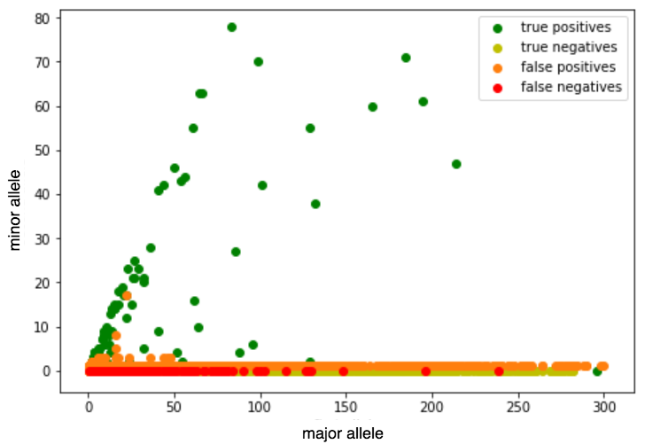

# Variant calling algorithm based on deciding on binomial distribution

> The goal of this project was implementation of variant calling algorithm based on deciding on binomial distribution in python and its results analysis. 

part1_VCF.py can be run from the command window.

Examples:

    part1_VCF.py --pileup=my_pileup_file.pileup --p=0.8 -o my_output_vcf.vcf
    
    part1_VCF.py --pileup=my_pileup_file.pileup --p=0.8
    
The first one takes pileup file and probability of success as inputs and outputs VCF file with the name given.
The second one takes pileup file and probability of success as inputs and outputs VCF on stdout.

Youtube video presentation: https://youtu.be/a-MCBty3oG8

## What is Variant Calling?

 Variant calling is a very important workflow in genomic variation studies. It includes identification of variants associated with a specific trait or population. Simply put - it is a process of finding differences between reference genome and sequence data. There are three main steps in the analyses that aims at variant calling. These steps are shown and briefly explained in the following figure. It is important to emphasize that these are not the only steps, but are the essential and the most important ones. 

  

The input of variant calling algorithm is a pileup file. Pileup file is a text file that summarizes the base calls of aligned reads to a reference sequence. A couple of lines in pileup file is shown below. Each line summarize one particular position in the genome. 

  

There will be one of two possible cases at each position in the pileup file:
  1. All bases will be the same.
  2. In the simplest case there will be two different bases, as there can be only two alleles at a site. 

The first one represents the scenario in which we, as a diploid organism, got the same base both from mother and from father. That base can be the same as the one in the reference genome, when the reference homozygous is called (0/0), which is the most common scenario. This base can differ from the reference base, when genotype is 1/1. In both scenarios it is clear what base should be called - the one that occurred. 

The other case needs some further calculation in order to make a decision. For this purpose we will use formula for binomial distribution 

  

where n represents total number of bases sequenced at the particular position, p is the probability of success (the probability that the pileup shows just what really is located at the particular position in the DNA) and k represents number of times we got the exact base we want to calculate f for.
After computing probabilities of all possible explanations of pileup, we pick the most probable one.

The output of the variant calling algorithm is VCF 4.2 file.

## Data

As mentioned previously, the algorithm takes pileup file as an input and produces the output VCF 4.2 file. 

For the purposes of this project, pileup file is generated with samtools pileup tool. This tool takes both reference and bam file as an input to produce the output in pileup format. 

The bam file is created from the exome portions of chromosomes 21, 22, Y and MT and is realigned with the latest version of human genome compatible with b37 by GATK. The reference fasta file is used in the 1000 genomes phase 3 project. It contains chromosomes (1-22, X, Y and MT), unlocalized and unplaced sequences (GL contigs), Epstein–Barr virus (NC_007605), decoy sequences (hs37d5, consisting of BAC+Huref+NA12878+Fosmid clones).

The test VCF file is created with bcftools call tool.

## Results

The first choice is p = 0.9. The confusion matrix is shown below. 

  

According to metrics written next to the confusion matrix, these results seem to be very bad - precision is unacceptably low. What caused this is a large number of false positives, variants that are present in the implemented solution, but not in the bcftools call tool. This choice is good for understanding the decision making though. 

Variants are shown in the figure below (note that not all variants are shown in the figure, for the purpose of making it interpretable).

  

As it can be seen from the figure, decision making is pretty pessimistic in this case - no matter how large the number of the first allele appearance during the sequencing process is, only one appearance of a different allele will cause the algorithm to call heterozygous variant. This is because the algorithm is pretty much sure there is no error in the previous steps of the analysis, so what is written in the pileupfile is what really occurs in the genome.

It is important to note that how you interprete these metrics strongly depends on what your survey goal is. It is sometimes much more important to detect all positives, so number of false negatives (missed detection) has to be as small as posible. In this case, it is probably less important not to have false positives (false alarm).

The second choice is p = 0.8. It seems to be a pessimistic choice, as the quality strings in the pileup file indicate that base call accuracies go up to 99.9% for each base. Confusion matrix is shown below. 

  

These results are much better than the previous one. True predictions went up, while false predictions decreased. As false positives decreased twenty-fold, precision is almost ten times larger. Variants are again shown in the figure below.

  

What is most striking when looking at the figure, is that the false positives that had very small number of second alleles (1 or 2) are now missing. As the probability of the success decreased, algorithm is more flexible and is allowed to consider whether some low count site represents the error or not. 

It is as well interesting to notice that false predictions are mostly overlapped with the true ones. This means that decreasing probability of success would not lead to any significant improvement, as the count of potential alleles does not separate positives from negatives. What is left to consider is the type of the variant. 

Indels are known to occur less frequently in the genome than SNVs do, so the last choice is to set probability of success to be adaptive - p = 0.8 if the site is a SNV or a match and p = 0.6 if it is an indel. The confusion matrix in this case is shown below. 

  

These seem to be very good results - the implemented solution found nearly 96% of all variants. Precision also went up for a couple of percent. This caused F1 score to go up to 81%, which is, compared to earlier results, quiet successful. 

Perhaps results are expected to be a little bit better, but if you opened pileup file you would notice that the data was not filtered - there is some low coverage data that is not suitable for processing and needs to be filtered out.

 

